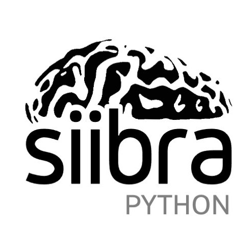

    

# siibra - Python interface for interacting with brain atlases 

*Authors: Big Data Analytics Group, Institute of Neuroscience and Medicine (INM-1), Forschungszentrum Jülich GmbH*

Copyright 2020-2021, Forschungszentrum Jülich GmbH 

> :warning: **`siibra-python` is still at an experimental stage.** The API of the library is not
stable, and the software is not yet fully tested. You are welcome to install and
test it, but be aware that you will likely encounter bugs.

## Overview

`siibra` is a Python client for interacting with "multilevel" brain atlases, which combine multiple brain parcellations, reference coordinate spaces and modalities. 
`siibra` is designed to allow safe and convenient interaction with brain definitions from different parcellations, to provide streamlined access to multimodal data features linked to brain regions, and to facilitate reproducible implementation of basic analyses with region-specific data features. 
In particular, `siibra` aims to unify access to regional data features at the millimeter and micrometer scale of the human brain.

`siibra` is largely developed inside the [Human Brain Project](https://humanbrainproject.eu) for accessing the [EBRAINS human brain atlas](https://ebrains.eu/service/human-brain-atlas). 
It stores most of its configuration and data features in the [EBRAINS Knowledge Graph](https://kg.ebrains.eu), and is designed to support the [OpenMINDS metadata standards](https://github.com/HumanBrainProject/openMINDS_SANDS).

The functionality of `siibra-python` matches common actions known from browsing the `siibra explorer` [hosted on EBRAINS](https://atlases.ebrains.eu/viewer): 
Selecting different parcellations, browsing and searching brain region hierarchies, downloading maps, selecting regions, and accessing multimodal data features associated with brain regions.
A key feature is a streamlined implementation of performing structured data queries for selected brain regions. 
`siibra` implements a hierarchy of features, which unifies handling of 

 - *spatial data features* (which are linked to atlas regions via coordinates; like contact points of physiological electrodes), 
 - *regional data features* (which are linked to atlases via a brain region specifications, like cell densities or neurotransmitter distributions), and 
 - *global data features* (linked to an atlas via the whole brain or parcellation, like connectivity matrices or activation maps). 

As a result, all forms of data features can be queried using the same mechanism (`get_features()`) which accepts the specification of a data modality, and considers the selected parcellation and regions in the atlas. 
Currently available data features include neurotransmitter densities, regional connectivity profiles, connectivity matrices, gene expressions, and spatial properties of brain regions. 
Additional features, including distributions of neuronal cells, functional activation maps and electrophysiologal recordings, will become available soon.
Stay tuned!

`siibra` hides much of the complexity that would be required to interact with the individual data repositories that host the associated data.
By encapsulating many aspects of interacting with different maps and reference templates spaces, it also minimizes common risks like misinterpretation of coordinates from different reference spaces, or utilisation of inconsistent versions of parcellation maps. 
It aims to provide a safe way of using maps defined across multiple spatial scales. 

## Documentation

The main place for `siibra-python`'s documentation is at https://siibra-python.readthedocs.io.

## Usage examples

To get familiar with `siibra`, we recommend to checkout the jupyter notebooks in the `examples/` subfolder of this repository. 

## Installation and setup

`siibra` is available on pypi.
To install the latest version, simply run `pip install siibra`.

`siibra` retrieves much of its data from the [EBRAINS Knowledge Graph](https://kg.ebrains.eu), which requires authentication. 
Therefore you have to provide an EBRAINS authentication token for using all features provided by `siibra`.

Please make sure that you have a valid EBRAINS user account by [registering to EBRAINS](https://ebrains.eu/register/). 
Then follow the instructions for [obtaining EBRAINS API auth tokens](https://kg.ebrains.eu/develop.html).
As a last step, you need to fetch a recent token from the [authorization endpoint](https://nexus-iam.humanbrainproject.org/v0/oauth2/authorize), and make it known to `siibra`.
There are two ways to do so:

1. Set an environment variable `HBP_AUTH_TOKEN` with the token before loading the `siibra` module. 
2. Set the token explicitly as follows: 

		from siibra.authentication import Authentication
		auth = Authentication.instance()
		auth.set_token(TOKEN)

*Note that as of now, you need to get a new token approximately every day to
perform EBRAINS data queries. However, `siibra` implements a local cache on
your harddisk, so once retrieved, your data will become usable and accessible
without refreshing the token.*

## Acknowledgements

This software code is funded from the European Union’s Horizon 2020 Framework
Programme for Research and Innovation under the Specific Grant Agreement No.
945539 (Human Brain Project SGA3).

