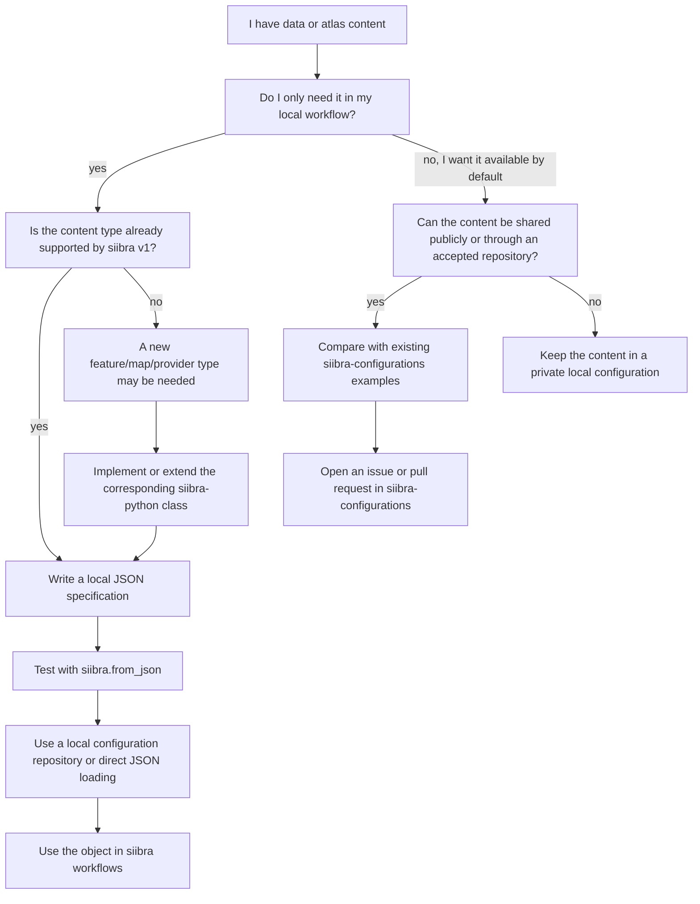

# Configuring atlas content

`siibra-python` can work with atlas content that is not part of the default
configuration. This page explains how to describe such content with
configuration files.

Configuration files are useful when a workflow needs to use private, local, or
project-specific data together with siibra objects. They can also be used as a
starting point for contributing content to the default `siibra-configurations`
repository.

The focus of this guide is local and private configuration. Integration into
the default configuration is described briefly at the end.

## What configuration files are for

Configuration files describe **foundational content**: atlas concepts and data
features that siibra can load as objects. A configuration file usually contains
metadata, anatomical references, and pointers to the actual data.

Typical use cases include:

* adding a local image volume as a data feature,
* adding a project-specific annotation map,
* adding a private region of interest or spatially anchored dataset,
* testing a new feature specification before sharing it,
* preparing content for a contribution to `siibra-configurations`.

Configuration files do not have to contain the data themselves. They usually
point to files or resources that siibra can access. In local workflows, these
resources can be files in local directories.

## Privacy and data access

Local configuration files and local data files can be used privately. When a
configuration points to local files, siibra reads the data from the local system.

However, some workflows use external services. In particular, transformations
between reference coordinate systems may require sending coordinate or location
information to a server that performs the spatial conversion. The image or data
file itself is not necessarily uploaded for such a coordinate transformation,
but the location information required for the transformation leaves the local
computer.

For sensitive data, check which parts of the workflow use local files only and
which parts call external services.

## Choosing the right route

The following flowchart summarizes the usual decision process.



## Configuration routes in siibra

siibra content can enter the system in three ways.

### Foundational content

Foundational content is described by JSON configuration files. These files
define atlas concepts such as spaces, parcellations, maps, and selected data
features.

The default foundational content is maintained in the `v1` branch of the
`siibra-configurations` repository:

https://github.com/FZJ-INM1-BDA/siibra-configurations/tree/v1

### Dynamic content from live queries

Dynamic content from live queries is discovered at runtime by querying external
services. Live queries are implemented in `siibra-python` and translate external
metadata into siibra feature objects.

Use configuration files when the content should be explicitly described by
JSON. Use live queries when content should be discovered dynamically from a
service with a stable API.

### Local user content

Local user content is content that is used in a local workflow but is not
intended to be part of the default siibra configuration. Examples include local
images, private feature files, custom maps, or project-specific spatial
annotations.

Local content can be described by JSON files and loaded directly with
`siibra.from_json(...)` or made available through a local configuration
repository.

## What a configuration file describes

A configuration file typically describes four things:

1. **Identity and metadata**

   * unique identifier,
   * name,
   * modality or category,
   * publications or dataset references, if available.

2. **Anatomical reference**

   * a brain area,
   * a parcellation,
   * a reference coordinate system,
   * a point, point set, or bounding box,
   * or a combination of semantic and spatial information.

3. **Data access**

   * local file paths,
   * remote URLs,
   * cloud image resources,
   * archives or file collections,
   * provider-specific options.

4. **Object type**

   * the `@type` field tells siibra which object class should be created from
     the JSON specification.

The exact required fields depend on the configured object type. Use existing
configuration files and the JSON schemas as references.

## Choosing the content type

The first step is deciding what kind of object the JSON file should create.

### Atlas concepts

Atlas concepts describe the structural organization of an atlas. Common types
include:

* reference atlas,
* brain-region terminology or parcellation,
* brain area,
* reference coordinate system,
* reference template,
* annotation map.

These objects usually belong in the corresponding folders of a configuration
repository, such as `atlases`, `parcellations`, `spaces`, or `maps`.

### Maps and templates

Maps and templates are spatial objects.

A **template** represents anatomy in a reference coordinate system. A template
may point to an image volume or a surface representation.

A **map** is an annotation set for a brain-region terminology in a reference
coordinate system. Maps may be labelled or statistical.

Use a labelled map when the data assign integer labels to brain areas. Use a
statistical map when the data contain continuous values, such as probabilities
or other weights.

### Data features

Data features describe multimodal measurements linked to brain areas or spatial
locations.

Examples include:

* image sections,
* volumes of interest,
* receptor density fingerprints,
* receptor density profiles,
* connectivity matrices,
* activity or BOLD time series,
* microscopy-derived features,
* MRI-derived features.

In siibra v1, each configured data feature must correspond to a feature class
known to the installed `siibra-python` version. Adding a completely new
unsupported modality may require code changes.

## Anatomical anchors for data features

A data feature needs an anatomical anchor. The anchor tells siibra what the
feature is about and how it can be matched to atlas concepts.

A feature can be anchored to:

* a brain area,
* a parcellation,
* a reference coordinate system,
* a point, point set, or bounding box,
* an image or spatial extent,
* a combination of semantic and spatial references.

Semantic anchors are useful when the measurement is known to belong to a brain
area. Spatial anchors are useful when the measurement is tied to coordinates,
bounding boxes, or image extents. Combining both can make feature matching more
specific.

## Data providers and local files

Providers describe how siibra can access the actual data. The provider key
indicates the format or retrieval mechanism, and the value points to the data.

A schematic volume definition looks like this:

```json
{
  "@type": "siibra/volume/v0.0.1",
  "providers": {
    "nii": "/path/to/local/image.nii.gz"
  }
}
```

For archive-based resources, a provider may refer to an archive and a file
inside the archive. A schematic example is:

```json
{
  "@type": "siibra/volume/v0.0.1",
  "providers": {
    "zip/nii": "/path/to/archive.zip image_inside_archive.nii"
  }
}
```

Provider keys depend on the formats supported by the installed
`siibra-python` version. For volume data, check existing map and template
configurations and the supported volume provider formats in the code.

## Minimal examples

The examples below are schematic. Use them as starting points and adapt them
to the schema and object type required for the data.

### Local image volume

This example sketches a local image volume that can be loaded as a siibra
object.

```json
{
  "@type": "siibra/volume/v0.0.1",
  "providers": {
    "nii": "/path/to/project/data/my_image.nii.gz"
  }
}
```

Test it with:

```python
import siibra

obj = siibra.from_json("/path/to/my_volume.json")
print(type(obj))

img = obj.fetch()
print(img)
```

### Image feature anchored by a bounding box

This example sketches an image-like data feature with a spatial anchor. The
bounding box coordinates must be expressed in the specified reference
coordinate system.

```json
{
  "@id": "my-project-feature-001",
  "@type": "siibra/feature/volume_of_interest/v0.1",
  "name": "Example local volume of interest",
  "modality": "MRI",
  "space": {
    "@id": "minds/core/referencespace/v1.0.0/example-space-id"
  },
  "providers": {
    "nii": "/path/to/project/data/example_voi.nii.gz"
  },
  "boundingbox": {
    "@type": "siibra/location/boundingbox/v0.1",
    "space": {
      "@id": "minds/core/referencespace/v1.0.0/example-space-id"
    },
    "coordinates": [
      [-20.0, -30.0, 40.0],
      [-10.0, -20.0, 50.0]
    ]
  }
}
```

Test the object type first:

```python
import siibra

feature = siibra.from_json("/path/to/my_feature.json")
print(type(feature))
print(feature)
```

If the object can be constructed, test the data access:

```python
data = feature.fetch()
print(data)
```

### Labelled map with a local volume

This example sketches a labelled map that points to a local integer-labelled
NIfTI image. The parcellation, space, and region-to-label mapping must match
the expected schema for the map type.

```json
{
  "@id": "my-labelled-map",
  "@type": "siibra/map/labelled/v0.1",
  "name": "Example local labelled map",
  "space": {
    "@id": "minds/core/referencespace/v1.0.0/example-space-id"
  },
  "parcellation": {
    "@id": "minds/core/parcellationatlas/v1.0.0/example-parcellation-id"
  },
  "volumes": [
    {
      "@type": "siibra/volume/v0.0.1",
      "providers": {
        "nii": "/path/to/project/data/example_labels.nii.gz"
      }
    }
  ],
  "indices": [
    {
      "region": "Example area 1",
      "label": 1
    },
    {
      "region": "Example area 2",
      "label": 2
    }
  ]
}
```

Use an existing labelled-map configuration as the reference when creating a
real file, because exact field names and index specifications depend on the
map schema.

## Testing a configuration file

A useful testing sequence is:

1. Start from a similar existing configuration.
2. Write the JSON file.
3. Validate against the schema, if possible.
4. Load the file with `siibra.from_json(...)`.
5. Inspect the created object.
6. Call `fetch()` or a small query to test data access.
7. Add the file to a local configuration repository if it should be reused.

### Schema check

JSON schemas are available in the `config_schema` folder of the
`siibra-python` repository. They describe expected fields for supported
configuration types.

From a checkout of `siibra-python`, a schema check can be run with the helper
script:

```bash
python config_schema/check_schema.py /path/to/my_configuration.json
```

If the command-line interface changes, inspect the helper script or run it with
`-h` to see the accepted arguments.

### Loading with siibra.from_json

The most direct functional test is to let siibra create an object from the JSON
file:

```python
import siibra

obj = siibra.from_json("/path/to/my_configuration.json")
print(type(obj))
print(obj)
```

If the object is a volume, map, template, or feature, test whether the linked
data can be fetched:

```python
data = obj.fetch()
print(data)
```

For larger data, use a small region, lower resolution, or a minimal example
first.

## Using a local configuration repository

For one-off testing, `siibra.from_json(...)` is often sufficient. For repeated
workflows, a local configuration repository can be more convenient.

A local configuration repository mirrors the structure of
`siibra-configurations`, for example:

```text
my-siibra-config/
├── atlases/
├── parcellations/
├── spaces/
├── maps/
└── features/
```

Place the JSON file in the folder corresponding to its content type. Then use
siibra's configuration-loading functions to make the repository available in a
workflow.

```python
import siibra

siibra.use_configuration("/path/to/my-siibra-config")
```

or, when extending the default configuration:

```python
import siibra

siibra.extend_configuration("/path/to/my-siibra-config")
```

Use `use_configuration(...)` when the local configuration should replace the
active configuration. Use `extend_configuration(...)` when the local content
should be added to the default configuration.

## Preparing content for siibra-configurations

Content that should become part of the default siibra configuration should be
prepared in the `v1` branch of the `siibra-configurations` repository:

https://github.com/FZJ-INM1-BDA/siibra-configurations/tree/v1

A contribution should usually include:

* a JSON specification in the appropriate folder,
* stable data access paths,
* clear names and identifiers,
* anatomical references,
* dataset or publication references where available,
* a small test or smoke test if the contribution changes expected behavior.

For data requests or larger integration discussions, open a GitHub issue before
preparing a large pull request.

## Unsupported modalities and code changes

If a data type is not supported by the installed `siibra-python` version, a JSON
file alone may not be enough. A new feature type, provider, decoder, or factory
mapping may be required.

A typical implementation path is:

1. Define the new configuration `@type`.
2. Add or extend the corresponding feature, map, volume, or provider class.
3. Register the class with the appropriate configuration folder or factory.
4. Export the class from the appropriate module if it is part of the public API.
5. Add tests for object creation and data access.
6. Add example configuration files.
7. Update documentation.

For implementation details, see the developer documentation.

## Further resources

* Concept guide: `concepts.rst`
* API reference: `api.rst`
* Developer documentation: `developer.rst`
* Example catalogue: `examples.rst`
* Default configuration repository:
  https://github.com/FZJ-INM1-BDA/siibra-configurations/tree/v1
* Configuration schemas:
  https://github.com/FZJ-INM1-BDA/siibra-python/tree/v1/config_schema
